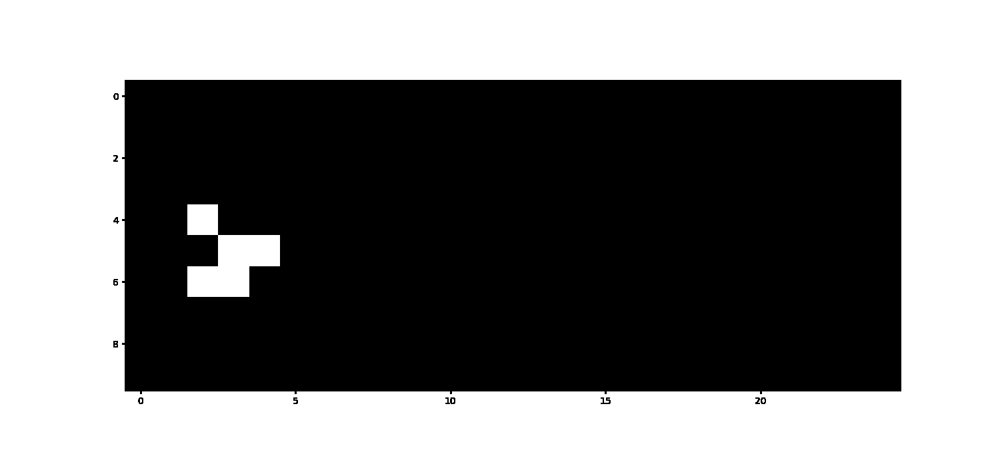

# Pygol



## Description

Pygol is a Python library for creating simulations of Conway's "Game of Life".

The Game of Life is a cellular automaton invented by British mathematician John Horton Conway in 1970. It is a mathematical model in which each cell in a two-dimensional grid can be in a dead or living state. The states of the cells change according to the states of their neighbours, following simple rules.

## Installation

The Game of Life is still under development but can be used by cloning its repository and manually installing the dependencies.
Once cloned, installation is done via [Pipenv](https://pipenv.pypa.io/en/latest/) by typing: 

```bash
pipenv install
```

And

```bash
pipenv install --dev
```

Some examples of how the module works are given in the "demo" notebook.
